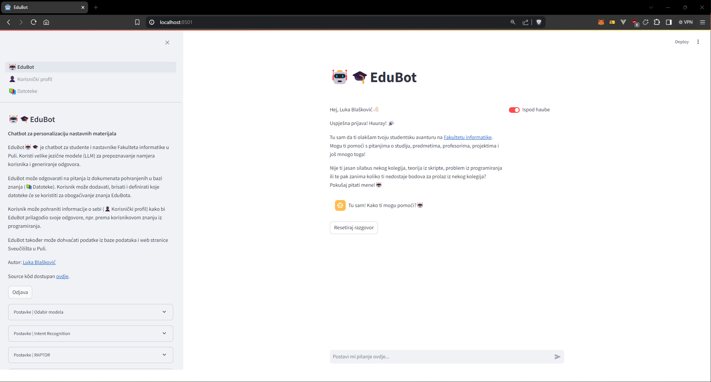

# 🤖🎓EduBot

**EduBot** is a powerful RAG (Retrieval-Augmented Generation) chatbot that utilizes the latest SOTA models to provide a seamless and interactive learning experience. It is designed to help students learn and understand complex concepts in a more engaging and interactive way.

This app is built for the purpose of my [Master's thesis](https://repozitorij.unipu.hr/islandora/object/unipu:9219) at the [Faculty of Informatics Pula](https://fipu.unipu.hr/fipu/en), Croatia.

## Features

- **Interactive Learning**: EduBot provides an interactive learning experience where students can ask questions and get instant answers.
- **Personalized Learning**: EduBot can provide personalized learning recommendations based on the student's programming knowledge and year of study.
- **Utilizes SOTA Models**: EduBot utilizes the latest SOTA models like GPT 4o and Claude 3 model family to provide accurate and relevant answers.
- **Multi-Modal Learning**: EduBot supports multi-modal learning by providing text, pdf documents, powerpoint slides, and other learning materials.

> 🤖🎓EduBot is built on top of [llamaindex](https://www.llamaindex.ai/) data framework and uses [Streamlit](https://streamlit.io/) for the front-end. There are 3 main UI components in the chatbot:

- **Chat Interface**: This is where the user can interact with the chatbot by asking questions and receiving answers, as well as configure the chatbot settings from the sidebar menu.
- **User profile**: This is where the user can view and edit their profile information, such as bio, programming knowledge, and year of study. Name and email cannot be edited since they are fetched from the user's Google account.
- **Learning Resources**: This is where the user can upload, view and modify their learning resources, such as text, pdf documents, powerpoint slides, and other learning materials. Once user uploads desired learning resources, embedding and indexing processes can be initiated for the purpose of building the RAPTOR tree, which is essentialy a knowledge graph that the chatbot uses to retrieve relevant information.

## Modules 🎡

EduBot works by combining three (3) RAG modules to provide a seamless learning experience.

1. **RAPTOR module**: This module utilizes [RAPTOR](https://arxiv.org/html/2401.18059v1) (Recursive Abstractive Processing for Tree-Organized Retrieval) technique which is a novel approach to enchance retrieval-augmented generation (RAG) models. RAPTOR creates a tree by recursively embedding, clustering, and summarizing text chunks, enabling retrieval at various abstraction levels. This hiearchical structure allows the chatbot to retrieve relevant information at different levels of abstraction, providing a more comprehensive and accurate answer to the user's query. RAPTOR was chosen as it is a novel approach and it achieves state-of-the-art performance on various benchmarks, such as QuALITY.

   - **raptor_module.py**: This module, built specifically for EduBot, contains the [llamaindex implementation of RAPTOR](https://github.com/run-llama/llama_index/tree/main/llama-index-packs/llama-index-packs-raptor), which inlcudes RAPTOR Pack and RAPTOR Retrieval. RAPTOR Pack is responsible for embedding, clustering, and summarizing text chunks to create the RAPTOR tree, while RAPTOR Retrieval is responsible for retrieving relevant information from the RAPTOR tree based on the user's query. This implementation was further upgraded to support multi-document retrieval and reloading of the RAPTOR tree for performance and cost efficiency. Currently, this RAPTOR module utilizes only [OpenAI text embedding models](https://platform.openai.com/docs/guides/embeddings) for the purpose of embedding text chunks (_text-embedding-3-small_ & _text-embedding-3-large_). However, it can be easily extended to support other text embedding models. As for retrieval, various models can be utilized, as shown later in this document.

2. **SQL-RAG module**: This module utilizes custom built text-to-sql approach for retrieving the relevant data from SQL database (currently only SQLite connector, but more can be added easily). This module outputs the SQL query which is then executed on the database to retrieve the relevant information. Once it's executed, the retrieved data is then passed to the generation model (along with user query) to generate the final answer.

3. **Web-scraper module**: This module is custom built for scraping information from University of Pula news website. It utilizes [`BeautifulSoup`](https://beautiful-soup-4.readthedocs.io/en/latest/) and `requests` libraries to scrape the news articles from the website. The scraped data is then passed to the generation model (along with user query) to generate the final answer.

### How is the correct module chosen? 🤔

- The correct module is chosen based on the user query. For instance, if the user query is related to programming in JavaScript, the **RAPTOR module** is chosen as it is more suitable for retrieving information from text-based sources like documentation, tutorials, and articles (this will work of course if the user has uploaded the relevant learning resources).

- On the other hand, if the user query is about specific data, such as the number of students enrolled in a particular course, total points for a specific exam, or any other data that can be found in the database, the **SQL-RAG module** is chosen.

- Lastly, if the user query is about the latest news or events happening at the University of Pula, the **web-scraper module** is chosen.

For each of this module, we created a [llamaindex query engine](https://docs.llamaindex.ai/en/stable/module_guides/deploying/query_engine/) that is responsible for executing the query and returning the results. Query engines are generic interfaces that allow users to ask questions over data. They are built on top of indexes via retrievers, but custom query engines can be built for any data source and retrieval method. These query engines are feeded with metadata description with instructions on when to choose a specific one.

- an additional query engine is created for scenario when user wants to ask a question that is not related to any of the modules mentioned above. In this case, the chatbot will use the default query engine for direct communication with the LLM.

Once the query engines return their result, the EduBot utilizes the [Router Query Engine](https://docs.llamaindex.ai/en/latest/examples/query_engine/RouterQueryEngine/) module which is a custom component that selects one out of several candidate query engines to execute a query based on the user's input. This component utilizes a ranking model which are called **Selector components**. For this purpose, [LLMSingleSelector](https://ts.llamaindex.ai/api/classes/LLMSingleSelector) component is used which selects the best query engine based on the user's input.

## LLMs supported 🧠🌐🧠

EduBot supports the following LLMs (Large Language Models) for generation:

### Paid LLM APIs

- **gpt-4o** (OpenAI)
- **gpt-4** (OpenAI)
- **gpt-3.5-turbo** (OpenAI)
- **Claude 3 Opus** (Anthropic)
- **Claude 3 Sonnet** (Anthropic)
- **Claude 3 Haiku** (Anthropic)

### Open LLMs running on Ollama

- **mistral:7b** (Mistral AI)
- **gemma:7b** (Google)
- **llama3:8b** (Meta)

Once the model is selected, all modules (RAPTOR, SQL-RAG, Web-scraper) will utilize the selected model for generation (as for RAPTOR module, it will utilize OpenAI text embedding models for cluster embeddings).

## Installation

1. Clone the repository:

```bash
git clone https://github.com/lukablaskovic/edu_bot.git
```

2. Create a virtual environment (`python 3.11`) (conda is recommended, but you can also use venv)

```bash
conda create -n edubot python=3.11
conda activate edubot
```

3. Install the required dependencies:

```bash
pip install -r requirements.txt
```

4. Add the required environment variables to the `.env` file (you can use the `.env.example` file as a template):

5. You must add `google_credentials.json` file to the root of the project. This file is used for Google authentication and it is required for fetching user's name and email. You can create a new project in the Google Cloud Console and download the credentials file from there. In the future, we will add the option to skip this step and use the chatbot without Google authentication.

6. Run the Streamlit app (yes it [contains emojis in the file name](https://docs.streamlit.io/get-started/tutorials/create-a-multipage-app), you can run it like this):

```bash
streamlit run 🤖EduBot.py
```



> Congratulations! You have successfully installed and run the EduBot app. You can now interact with the chatbot and explore its features.

Note: The UI is currently only in Croatian language.

## Demo

#### Saying "Hi" to the chatbot will trigger triger the default query engine and the chatbot will respond with chit-chat response.


#### Wher user asks a question related to programming or IT in general, the EduBot will use the RAPTOR module and try to retrieve knowledge from the uploaded learning resources.

- in this example, the user asks how to create a function in JavaScript, and the chatbot retrieves the relevant information from the uploaded JavaScript learning resource. Moreover, "Under the hood" mode is enabled, so the user can see what the EduBot is doing in the background to answer the user's query.


#### This time, the user wants ask questions regarding the course "Software Engineering". User may easily upload course syllabus using drag and drop interface, select the files and build the RAPTOR knowledge graph out of those.

- in this example, user uploads the course syllabus for the "Software Engineering" course builds the RAPTOR tree along with two other JavaScript learning resources hence the files are quite different (syllabus for course information and JavaScript script with examples and code snippets).


#### Now we can retrieve information from that syllabus. User asks about the college professor and what are the topics covered in the course.

- "Who is the professor for the Software Engineering course?" query is being processed using gpt-4o model
- "What are the topics covered in the Software Engineering course?" query is being processed using llama3:8b model (open source model running on Ollama)


#### EduBot may adjust its respone based on the user's programming knowledge and year of study. In this example, the user asks about recursion concept in JavaScript and the chatbot provided less details to the user who is in the first year of study with basic programming knowledge.


#### The following gif demonstrates the chatbot's response when the user asks about students or points of course (Programming in Scripting languages) that are stored in the SQLite database. The SQL-RAG module is used in this case. "Under the hood" mode is enabled, so the user can see the generated SQL query.


#### Finally, the user asks about the latest news from the University of Pula - Faculty of Informatics. The chatbot uses the web-scraper module to scrape the news articles from the website and generate the response, utilizing Claude 3 Opus model.


## Acknowledgements

I would like to thank my mentor [prof. Nikola Tanković](https://www.tankovic.me/) for his guidance and support throughout the development of this project (as well for OpenAI credits 😇).

I would also like to thank the Faculty of Informatics Pula for providing me with the opportunity to work on this project and for their support.

## Tools and Technologies 🛠

- [Python](https://www.python.org/)
- [LlamaIndex](https://www.llamaindex.ai/)
- [Streamlit](https://streamlit.io/)
- [OpenAI](https://platform.openai.com/)
- [Anthropic](https://www.anthropic.com/)
- [Ollama](https://ollama.ai/)
- [RAPTOR](https://arxiv.org/html/2401.18059v1)
- [DB Browser for SQLite](https://sqlitebrowser.org/)

## License

This project is licensed under the MIT License - see the [LICENSE](LICENSE) file for details.
